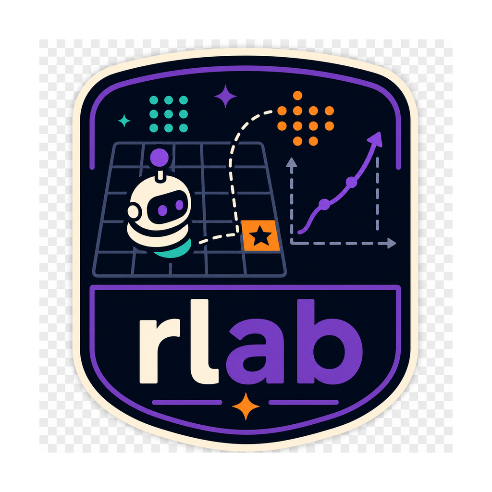

<div align="center">
  

  **Reinforcement-learning workbench for training game agents**
</div>

rlab is a Python CLI for training, evaluating, replaying, and operating reinforcement-learning game agents. It is built around Stable Retro environments, Stable-Baselines3 actor-critic models, W&B artifacts, and queue-backed one-job GPU containers, so a researcher can move from a checked-in experiment recipe to a replayable checkpoint without hand-wiring each step.

The normal workflow is to install the CLI once with `./install.sh`, then use `rlab` commands directly from the repo root. Do not wrap the examples below in `uv run`; the installed tool owns its runtime environment.

## Install

```bash
git clone git@github.com:tsilva/rlab.git
cd rlab
./install.sh
```

If you are reinstalling after local changes:

```bash
./install.sh
```

`install.sh` exports exact constraints from the committed `uv.lock` and installs the
`rlab` command as an editable uv tool. Re-running it preserves the locked dependency
versions and does not modify tracked files.

Refresh the forward Stable Retro and Mario runtimes explicitly when that is intended:

```bash
./refresh-runtimes.sh
```

The refresh command advances the package-specific cutoffs, updates `uv.lock`, keeps
the user-level uv configuration in sync, and then reinstalls the tool.

This repo uses uv's seven-day `exclude-newer` protection, with package-specific exceptions for the exact Stable Retro requirement and minimum Mario runtime recorded in `uv-tool.toml`, `pyproject.toml`, `uv.lock`, and the user-level uv config used by `uv tool install`.

After installation, run commands as plain `rlab ...`:

```bash
rlab --help
rlab validate
```

Import ROMs through the installed CLI so playback and training see them in the same runtime:

```bash
rlab import-roms ~/Desktop/roms --game SuperMarioBros-Nes-v0
```

## Run

Start with the built-in ROM-free native-vector smoke environment:

```bash
rlab env inspect rlab:Bandit-v0
rlab env preflight \
  --goal-file experiments/goals/rlab__bandit/_goal.yaml \
  --recipe-file experiments/recipes/bandit/ppo.yaml
```

Run its complete queue-backed local training and checkpoint-evaluation path:

```bash
rlab experiment launch --from-head \
  --goal-file experiments/goals/rlab__bandit/_goal.yaml \
  --recipe-file experiments/recipes/bandit/ppo.yaml \
  --machine local-macbook \
  --checkpoint-eval-backend local \
  --wait terminal \
  --json \
  --set recipe_id=local-smoke \
  --set campaign_id=local-smoke \
  --set logging.wandb=false \
  --set logging.wandb_mode=disabled \
  --set logging.wandb_artifact_storage_uri=
```

`rlab:Bandit-v0` has no renderer. Replay it headlessly with
`rlab play <checkpoint> --debug` for interactive stepping or add a positive `--episodes` limit
for unattended playback.

For a ROM-backed Mario smoke run, use the same queue path with explicit smoke overrides:

```bash
rlab experiment launch --from-head \
  --goal-file experiments/goals/SuperMarioBros-Nes-v0/Level1-1/_goal.yaml \
  --recipe-file experiments/recipes/mario/single/ppo.yaml \
  --machine local-macbook \
  --checkpoint-eval-backend none \
  --wait terminal \
  --json \
  --set recipe_id=local-mario-smoke \
  --set campaign_id=local-mario-smoke \
  --set train.timesteps=512 \
  --set train.environment.env_config.n_envs=1 \
  --set logging.wandb=false \
  --set logging.wandb_mode=disabled \
  --set logging.wandb_artifact_storage_uri=
```

Inspect the resulting launch and `result.json`:

```bash
rlab experiment status --machine local-macbook --json
```

Queue comparable experiments from checked-in recipe files:

```bash
rlab experiment launch --from-head \
  --goal-file experiments/goals/<goal-slug>/_goal.yaml \
  --recipe-file experiments/recipes/<family>/<recipe>.yaml \
  --machine beast-3 \
  --runtime-image-ref-file rlab-train-image.json
```

For short-lived queue-backed ablations, compose the checked-in goal and recipe and
apply repeatable Hydra/OmegaConf dotlist overrides from the CLI:

```bash
rlab experiment launch --from-head \
  --goal-file experiments/goals/SuperMarioBros-Nes-v0/Level1-1/_goal.yaml \
  --recipe-file experiments/recipes/mario/single/ppo.yaml \
  --machine beast-3 \
  --set recipe_id=lr2e4 \
  --set campaign_id=Level1-1-lr2e4 \
  --set train.backend.config.learning_rate=2e-4 \
  --seed 1
```

Overrides are recorded in the queued recipe payload and W&B config as
`recipe_overrides`. Give each comparable variant a distinct `recipe_id` so
leaderboards do not mix sweep arms. Each submission receives one generated
`bx<16 hex>` `batch_id`, shared by all of its seeds and used as the W&B group.
Use optional `campaign_id` to connect related submissions over time.

If `rlab-train-image.json` is absent, omit `--runtime-image-ref-file`. `rlab experiment launch --from-head` pins committed HEAD in an isolated worktree and waits for its exact-source receipt. The receipt may reuse an immutable image when the content-addressed runtime inputs match a prior source state; it never falls back without that proof. The exact source, recipe composition, runtime fingerprint, runtime build source, and digest remain recorded.

## Commands

```bash
rlab validate                                      # validate goals, recipes, benchmarks, and machine config
rlab env list                                      # list declared providers and environments without importing them
rlab env inspect rlab:Bandit-v0
rlab env preflight --goal-file experiments/goals/rlab__bandit/_goal.yaml --recipe-file experiments/recipes/bandit/ppo.yaml
rlab env inspect supermariobrosnes-turbo:SuperMarioBros-Nes-v0
rlab env preflight --goal-file experiments/goals/SuperMarioBros-Nes-v0/Level1-1/_goal.yaml --recipe-file experiments/recipes/mario/single/ppo.yaml
rlab experiment launch --from-head --goal-file experiments/goals/<goal-slug>/_goal.yaml --recipe-file experiments/recipes/<family>/<recipe>.yaml --machine beast-3 --json
rlab eval run --game <GameId> --policy random --episodes 2 --max-steps 600
rlab play <run-name>                                  # resolves the promoted checkpoint; never moving :latest
rlab play <entity>/<project>/rlab-<run-id>-checkpoint:latest
rlab play hf://tsilva/NES-SuperMarioBros_Level1-2_gray84-hudcrop-stack4-simple_ppo
rlab play <checkpoint> --debug                       # Enter steps once; use help for commands
rlab play <checkpoint> --attribution gradcam
rlab play <checkpoint> --attribution occlusion --attribution-interval 12
rlab experiment status --machine beast-3 --json
rlab experiment follow --run <run-id> --jsonl
rlab experiment wait --run <run-id> --until terminal --timeout 12h
rlab experiment cancel --run <run-id> --wait
rlab experiment retry-finalization --run <run-id>
rlab experiment logs --run <run-id> --follow
rlab leaders runs --goal <goal-slug> --min-seeds 3
rlab leaders checkpoints --goal <goal-slug>
rlab leaders checkpoints --goal <goal-slug> --limit 1 --json
rlab reports plan --goal <goal-slug>
rlab reports sync --goal <goal-slug>
rlab reports verify --goal <goal-slug>
rlab fleet drain --machine beast-3
rlab fleet resume --machine beast-3
rlab fleet service status --json
rlab eval modal status
rlab benchmark list
rlab benchmark run mario-env-throughput-l11 --dry-run
```

The command surface is intentionally one binary:

- `rlab experiment launch` is the only supported training-run entrypoint. It enqueues a PostgreSQL run and
  runs the same immutable Docker supervisor locally (`local-macbook`) or over SSH (Beast hosts).
  `python -m rlab.train` is an internal learner entrypoint reserved for that supervisor, tests,
  and explicitly labelled W&B-disabled core microbenchmarks.
- `rlab eval run` runs local/scripted or explicit-model evaluation. Queue-backed experiments evaluate saved checkpoints asynchronously; Modal uses bounded remote CPU workers, while explicit `rlab eval run` stays local.
- `rlab play` replays a local model path, W&B checkpoint artifact, or Hugging Face model repo.
- `rlab env` lists static provider contracts, inspects one qualified environment, or explicitly
  preflights a materialized recipe against the installed native runtime.
- `rlab experiment` launches and observes training runs. `rlab fleet` owns infrastructure and queue-schema maintenance.
- `rlab leaders` queries W&B for run/recipe winners and best evaluated checkpoints.
- `rlab reports` plans, explicitly synchronizes, and verifies source-controlled W&B reports.
- `rlab benchmark` runs named local-smoke and throughput profiles with executable gates.

`rlab env list` and `rlab env inspect` are static and do not import provider modules or access
ROMs. `rlab env preflight` is an explicit, recipe-backed behavioral probe: it constructs the same
native provider used by training, checks vector reset/step and visible masked-reset preservation,
then binds and steps the normal rlab runtime. Its report separates declared configuration,
runtime-observed evidence, and hidden reset invariants backed by the pinned provider contract;
it does not claim that emulator or RNG internals are black-box observable. Pass `--json` for one
versioned report on stdout; provider diagnostics are routed to stderr.

Maintenance commands are intentionally outside the normal research loop:

- `rlab fleet queue reset-schema --dry-run` previews an administrative queue-schema export and reset; rerun without `--dry-run` only when that destructive operation is intended.

## Research Loop

Active research contracts live under `experiments/goals/`. For current Mario work, read the goal's `_goal.yaml` before choosing recipes, caps, metrics, or promotion criteria.

Train recipes are validated against the queue-backed schema before enqueue. Extra research metadata is preserved, but required launch, naming, W&B, seed, selection, and train-config fields must be present and well-formed.

For new queue-backed runs, `goal.eval` is the only acceptance source. Every periodic checkpoint and
the natural final model receive one immutable 100-episode acceptance manifest. The Modal worker
stops on the first valid failed episode; the first complete 100/100 result is atomically promoted and
creates the learner stop command. Workers never open W&B or queue tables. W&B is the visibility
layer, R2 is permanent byte/evidence storage, and PostgreSQL is durable orchestration state plus a
transient telemetry mailbox.

The Docker launch owns scarce training capacity. It becomes successful only after required R2
handoffs and the final Neon watermark are acknowledged, then releases the GPU without waiting for
W&B. The logical run remains `finalizing` while Modal evaluation, promotion, and Fleet-owned W&B
publication finish. `training_finished_at` reports the launch boundary;
`finished_at` reports overall completion. Exhausted post-train retries produce
`finalization_failed` without changing the successful launch, and
`rlab experiment retry-finalization --run <id>` reopens only that phase.

The accepted checkpoint itself becomes the promoted model, even if the learner advances slightly
before observing the stop. Its artifact projection receives immutable `step-<n>` plus `promoted` and
`latest` aliases; later results cannot replace the first accepted checkpoint. A run is reported
successful only after W&B remotely confirms `finished`, final cursors, acceptance metrics, and the
promoted artifact aliases.

`rlab experiment status --run <id> --json` reports the launch, evaluation, publication,
incident, R2 checkpoint, and immutable W&B artifact projections; `artifact_status=playable`
means the promoted checkpoint is ready while historical backfill continues. Modal-backed enqueue fails closed when the
fleet evaluator's latest pass is stale or unsuccessful. Projection failures retry with backoff and
are isolated to their producing run; after correcting a persistent failure, reset only that run
with `rlab experiment retry-finalization --run <run-id>`.

To ask for the current best evaluated checkpoint for a goal, query the checkpoint leaders with a
single-row limit:

```bash
rlab leaders checkpoints --goal Level1-1 --limit 1 --json
```

`leaders checkpoints` returns evaluated checkpoint rows already sorted by the checkpoint promotion
order, so `--limit 1` is the canonical best-checkpoint query. Use `leaders runs` separately when
the question is about training/recipe winners rather than the checkpoint artifact to play or promote.
`leaders runs` uses the current primary goal metric by default for fast W&B queries.

Mario W&B report definitions live in
`experiments/goals/SuperMarioBros-Nes-v0/_reports.yaml`. Preview the deterministic local plan,
explicitly synchronize it, and verify the saved report structure with:

```bash
rlab reports plan
rlab reports sync
rlab reports verify
```

Reports are live W&B queries; new train and evaluation data appears without another sync. Sync is
needed only when report declarations, goal contracts, or the set of goals changes. Generated report
content is source-owned, so direct W&B edits are replaced by the next sync.

## Publish a Policy

Policies publish under `tsilva` with a generated repository identity:

```text
<game-family>_<goal>_<policy-variant>_<algorithm>
```

For example:

```text
tsilva/NES-SuperMarioBros_Level1-1_gray84-hudmask-stack4-simple_ppo
```

The game family comes from rlab's provider-neutral registry, the policy variant comes from the
saved observation/action contract, and the algorithm comes from checkpoint metadata. Provider,
run, recipe, seed, runtime, and environment hash remain in `model_metadata.json` and
`release_manifest.json`; they are not manually encoded in the repository name.

Use the project `$upload-checkpoint` skill for releases. Before any Hub mutation, preview the exact
identity with the repository-owned release helper:

```bash
uv run python scripts/prepare_huggingface_release.py \
  --goal-file experiments/goals/SuperMarioBros-Nes-v0/Level1-1/_goal.yaml \
  --model-metadata runs/<run>/checkpoints/<checkpoint>.metadata.json \
  --identity-only
```

The complete workflow requires stochastic evaluation evidence, a browser-safe `replay.mp4`, the
matching public YouTube preview, and the exact seven-file Hugging Face release bundle. The helper
rejects unknown families, inconsistent model classes, manual names, non-portable paths, extra
files, and invalid hashes before upload.

`README.md` is generated from the same manifest, metadata, and evaluation evidence as the release;
it is not a separate hand-maintained input. After publishing and tagging a release, audit the live
Hub state through the API:

```bash
uv run python scripts/audit_huggingface_release.py \
  tsilva/NES-SuperMarioBros_Level1-1_gray84-hudmask-stack4-simple_ppo \
  --revision v1
```


## Fleet

Queue-backed training is the supported GPU workflow. Every `rlab experiment launch` run
names one registered machine. Three launchd-supervised Mac controllers own
machine reconciliation, evaluation/promotion, and isolated per-run W&B
publication. They poll PostgreSQL every two seconds; runner machines remain
SSH/Docker-only.

```bash
rlab fleet service install
rlab fleet service watch
rlab fleet service status --json
rlab experiment status --machine beast-3 --json
```

`rlab fleet service watch` is the read-only scheduler dashboard: it separates launchd health from
authoritative workload state and shows active phases, automatic retries, eval-load admission waits,
and only conditions that still block an active run. Use `--once` for one human snapshot, `--plain` for an
append-only stream, or `--json` for one structured snapshot. Use `rlab fleet service logs --follow`
for raw service events and `rlab experiment status ...` for full run evidence.

Hard fleet capacity and exact machine configuration come from
`experiments/machines.yaml`. `INSTANCES.md` is the authoritative operator guide
for service operation, job status, host setup, cleanup, hardware, concurrency,
and beast host recommendations.

## Notes

- Python is pinned to `==3.14.*`; dependency resolution and lock state are managed by `uv`.
- The installed console command is `rlab`; examples should not use `uv run`.
- Runtime support is pinned for macOS arm64 and Linux x86_64 with `stable-retro-turbo`.
- Stable Retro matches ROMs by SHA, not filename. Import ROMs with `rlab import-roms` for the game ids you train or play.
- Every queue-backed training recipe must include a non-empty `description`; `rlab experiment launch` records it as the run description.
- Queue-backed W&B run names are `<batch_id>-<recipe_id>-s<effective_seed>-<utc>` and use an opaque `rlab-...` run id. Projects identify canonical game families, while config/tags identify the goal, recipe, provider, campaign, and exact environment hash.
- Canonical W&B projects are `SuperMarioBros-Nes-v0` for SMB1, `SuperMarioBros3-Nes-v0` for SMB3, `Breakout-Atari2600-v0` for ALE or Stable Retro Breakout, and `MsPacman-Atari2600-v0` for ALE or Stable Retro Ms. Pac-Man. An explicit `wandb_project` still overrides this routing; unknown environments use their provider-local environment id.
- New W&B model artifact collections and R2/S3 object paths use the immutable run id. Playback continues to resolve historical display-name artifacts and the legacy `breakout` and `ms_pacman` projects.
- Training logs to W&B and uploads model artifacts unless the recipe sets
  `logging.no_wandb_artifacts: true` (or `--set logging.no_wandb_artifacts=true`).
- Queue-backed train jobs are profileless by default and should reference immutable runtime image digests.
- Modal checkpoint acceptance is configured in `experiments/modal_eval.yaml`, uses PostgreSQL as
  its only wait queue, and dispatches at most 10 evaluation calls concurrently. Use
  `rlab eval modal smoke-local` for the credential-free integration path.
- The train-image workflow publishes the exact immutable image receipt immediately after the image
  exists, then deploys and startup-probes the digest-specific Modal evaluator and publishes a
  separate Modal readiness receipt. Local and no-eval submissions do not wait for Modal. Modal-backed
  submissions also run the live schema, capacity, asset, and deployment preflight before inserting
  queue rows. Use `rlab eval modal preflight --runtime-image-ref <digest-ref> --game <game-id>` for
  operator diagnosis, `--checkpoint-eval-backend local` for the explicit local fallback, or
  `--checkpoint-eval-backend none` only for a non-promotable smoke/debug run.
- Set `WANDB_API_KEY` for online W&B. For R2/S3-backed reference artifacts, set
  `CHECKPOINT_BUCKET_URI` or configure `logging.wandb_artifact_storage_uri` in the recipe,
  along with the required `AWS_*` credentials.
- Set `WORKER_MAILBOX_DATABASE_URL` to a pooled TLS Neon URL for the restricted mailbox role.
  Run `rlab fleet queue setup --worker-mailbox-role <role>` as the control-plane role to grant only the
  three authenticated worker procedures; worker attempt tokens are generated and expired by Fleet.
- Acceptance evaluation captures no video and performs no direct W&B operation. Release publishing
  remains responsible for the representative replay.
- Keep generated checkpoints, logs, videos, W&B files, caches, and scratch outputs out of source control.
- Local eval outputs are written under `runs/local_evals/<run-name>/`.

## License

No license file is present in this repository.
